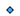

<h1>Computer</h1>

<a href="https://github.com/CharlesCarley/HackComputer#~">~</a>
<a href="index.md#index">HackComputer</a>
/
<a href="a00894.md#hack">Hack</a>
::
<b>Computer</b>
 
 

<h2>Namespaces</h2>

<a href="a00905.md#detail">Detail</a>

<h2>Classes</h2>

<a href="a01198.md#application">Application</a>

<a href="a01206.md#commandruntime">CommandRuntime</a>

<a href="a01202.md#commandruntimeprivate">CommandRuntimePrivate</a>

<a href="a01214.md#debugruntime">DebugRuntime</a>

<a href="a01210.md#debugruntimeprivate">DebugRuntimePrivate</a>

<a href="a01218.md#runtimeinterface">RuntimeInterface</a>

<h2>Enums</h2>
<a href="#colors" class="icon-list-item">Colors
</a>

 
<a href="#options" class="icon-list-item">Options
</a>

 

<h2>Typedefs</h2>
<a href="#asmparser" class="icon-list-item">AsmParser
</a>

 
<a href="#clock" class="icon-list-item">Clock
</a>

 
<a href="#cmd" class="icon-list-item">Cmd
</a>

 
<a href="#cmdswitch" class="icon-list-item">CmdSwitch
</a>

 
<a href="#codegen" class="icon-list-item">CodeGen
</a>

 
<a href="#instructions" class="icon-list-item">Instructions
</a>

 
<a href="#time" class="icon-list-item">Time
</a>

 
<a href="#vmparser" class="icon-list-item">VmParser
</a>

 

<h2>Variables</h2>
<a href="#switches" class="icon-list-item">Switches
</a>

 

<h4>Defined in</h4>
<a href="https://github.com/CharlesCarley/HackComputer/blob/master/Source/Computer/Application.cpp#L42" class="icon-list-item">Application.cpp
</a>

 
 
<a href="#computer" class="icon-list-item">top
</a>

<h2>Colors</h2>
<b>Colors</b>
 

Grey

Highlight

WireTitle

Action

Action2

Wire

Title

WireShadow

WireLight

<h4>Defined in</h4>
<a href="https://github.com/CharlesCarley/HackComputer/blob/master/Source/Computer/DebugRuntime.cpp#L35" class="icon-list-item">DebugRuntime.cpp
</a>

 
 
<a href="#computer" class="icon-list-item">top
</a>

 

<h2>Options</h2>
<b>Options</b>
 

OP_CMD

OP_DEBUG

OP_RUN_END

OP_TRACE_MEM

OP_SHOW_XML

OP_SHOW_DOT

OP_SHOW_VM

OP_SHOW_ASM

OP_SHOW_MC

OP_MAX

<h4>Defined in</h4>
<a href="https://github.com/CharlesCarley/HackComputer/blob/master/Source/Computer/Application.cpp#L54" class="icon-list-item">Application.cpp
</a>

 
 
<a href="#computer" class="icon-list-item">top
</a>

 

<h2>AsmParser</h2>
<a href="a00922.md#parser">Assembler::Parser</a>
<b>AsmParser</b>
 

<h4>Defined in</h4>
<a href="https://github.com/CharlesCarley/HackComputer/blob/master/Source/Computer/Application.cpp#L49" class="icon-list-item">Application.cpp
</a>

 
 
<a href="#computer" class="icon-list-item">top
</a>

 

<h2>Clock</h2>
std::chrono::high_resolution_clock
<b>Clock</b>
 

<h4>Defined in</h4>
<a href="https://github.com/CharlesCarley/HackComputer/blob/master/Source/Computer/Application.cpp#L43" class="icon-list-item">Application.cpp
</a>

 
 
<a href="#computer" class="icon-list-item">top
</a>

 

<h2>Cmd</h2>
<a href="a01238.md#parser">CommandLine::Parser</a>
<b>Cmd</b>
 

<h4>Defined in</h4>
<a href="https://github.com/CharlesCarley/HackComputer/blob/master/Source/Computer/Application.cpp#L47" class="icon-list-item">Application.cpp
</a>

 
 
<a href="#computer" class="icon-list-item">top
</a>

 

<h2>CmdSwitch</h2>
<a href="a01230.md#switch">CommandLine::Switch</a>
<b>CmdSwitch</b>
 

<h4>Defined in</h4>
<a href="https://github.com/CharlesCarley/HackComputer/blob/master/Source/Computer/Application.cpp#L48" class="icon-list-item">Application.cpp
</a>

 
 
<a href="#computer" class="icon-list-item">top
</a>

 

<h2>CodeGen</h2>
<a href="a01178.md#generator">Compiler::CodeGenerator::Generator</a>
<b>CodeGen</b>
 

<h4>Defined in</h4>
<a href="https://github.com/CharlesCarley/HackComputer/blob/master/Source/Computer/Application.cpp#L51" class="icon-list-item">Application.cpp
</a>

 
 
<a href="#computer" class="icon-list-item">top
</a>

 

<h2>Instructions</h2>
<a href="a00922.md#instructions">Assembler::Parser::Instructions</a>
<b>Instructions</b>
 

<h4>Defined in</h4>
<a href="https://github.com/CharlesCarley/HackComputer/blob/master/Source/Computer/Application.cpp#L46" class="icon-list-item">Application.cpp
</a>

 
 
<a href="#computer" class="icon-list-item">top
</a>

 

<h2>Time</h2>
std::chrono::time_point&lt; 
<a href="a00904.md#clock">Clock</a>
, Clock::duration &gt;
<b>Time</b>
 

<h4>Defined in</h4>
<a href="https://github.com/CharlesCarley/HackComputer/blob/master/Source/Computer/Application.cpp#L44" class="icon-list-item">Application.cpp
</a>

 
 
<a href="#computer" class="icon-list-item">top
</a>

 

<h2>VmParser</h2>
<a href="a01342.md#parser">VirtualMachine::Parser</a>
<b>VmParser</b>
 

<h4>Defined in</h4>
<a href="https://github.com/CharlesCarley/HackComputer/blob/master/Source/Computer/Application.cpp#L50" class="icon-list-item">Application.cpp
</a>

 
 
<a href="#computer" class="icon-list-item">top
</a>

 

<h2>Switches</h2>
constexpr 
<a href="a00904.md#cmdswitch">CmdSwitch</a>
<b>Switches</b>
 

<h4>Defined in</h4>
<a href="https://github.com/CharlesCarley/HackComputer/blob/master/Source/Computer/Application.cpp#L67" class="icon-list-item">Application.cpp
</a>

 
 
<a href="#computer" class="icon-list-item">top
</a>

 

</body>
</html>
