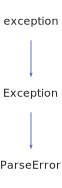

<h1>Exception</h1>

<a href="https://github.com/CharlesCarley/HackComputer#~">~</a>
<a href="index.md#index">HackComputer</a>
/
<a href="a00915.md#hack">Hack</a>
::
<b>Exception</b>
 
 

<h4>Derived From</h4>

<b>exception</b>

<h4>Derived By</h4>

<a href="a01575.md#parseerror">Hack::ParseError</a>

 

<h2>Private Members</h2>
<a href="#_string" class="icon-list-item">_string
</a>

 

<h2>Public Methods</h2>
<a href="#exception" class="icon-list-item">Exception
</a>

 
<a href="#exception" class="icon-list-item">Exception
</a>

 
<a href="#exception" class="icon-list-item">Exception
</a>

 
<a href="#what" class="icon-list-item">what
</a>

 

<h4>Defined in</h4>
<a href="https://github.com/CharlesCarley/HackComputer/blob/master/Source/Utils/Exception.h#L33" class="icon-list-item">Exception.h
</a>

 
 
<a href="#exception" class="icon-list-item">top
</a>

<h2>_string</h2>
<a href="a00915.md#string">String</a>
<b>_string</b>
 

<h4>Defined in</h4>
<a href="https://github.com/CharlesCarley/HackComputer/blob/master/Source/Utils/Exception.h#L35" class="icon-list-item">Exception.h
</a>

 
 
<a href="#exception" class="icon-list-item">top
</a>

 

<h2>Exception</h2>
<b>Exception</b>
<i>(</i>

const char *
what

<i>)</i>

<h4>References</h4>

<a href="a01551.md#debugbreak">debugBreak</a>

<h4>Defined in</h4>
<a href="https://github.com/CharlesCarley/HackComputer/blob/master/Source/Utils/Exception.h#L38" class="icon-list-item">Exception.h
</a>

 
 
<a href="#exception" class="icon-list-item">top
</a>

 

<h2>Exception</h2>
<b>Exception</b>
<i>(</i>

<a href="a00915.md#string">String</a>
what

<i>)</i>

<h4>References</h4>

<a href="a01551.md#debugbreak">debugBreak</a>

<h4>Defined in</h4>
<a href="https://github.com/CharlesCarley/HackComputer/blob/master/Source/Utils/Exception.h#L45" class="icon-list-item">Exception.h
</a>

 
 
<a href="#exception" class="icon-list-item">top
</a>

 

<h2>Exception</h2>
<b>Exception</b>
<i>(</i>

const 
<a href="a00915.md#string">String</a>
 &amp;
what

Args &amp;&amp;...
args

<i>)</i>

<h4>References</h4>

<a href="a01555.md#what">what</a>

<a href="a01551.md#debugbreak">debugBreak</a>

<h4>Defined in</h4>
<a href="https://github.com/CharlesCarley/HackComputer/blob/master/Source/Utils/Exception.h#L53" class="icon-list-item">Exception.h
</a>

 
 
<a href="#exception" class="icon-list-item">top
</a>

 

<h2>what</h2>
const char *
<b>what</b>
<i>(</i>
<i>)</i>

<h4>Defined in</h4>
<a href="https://github.com/CharlesCarley/HackComputer/blob/master/Source/Utils/Exception.h#L64" class="icon-list-item">Exception.h
</a>

 
 
<a href="#exception" class="icon-list-item">top
</a>

 
 
<blockquote>
The following sources were used to generate this page.
 
<a href="../xml/a01555.xml#L1" class="icon-list-item">a01555.xml
</a>

 
<a href="../xml/compound.xsd#L1" class="icon-list-item">compound.xsd
</a>

</blockquote>

</body>
</html>
