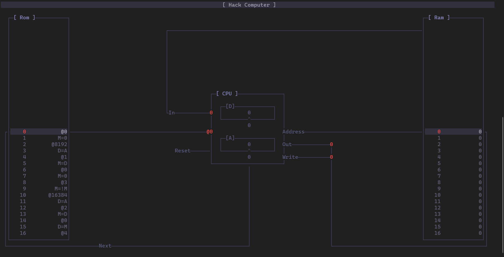

<a id="computer"></a>
<h1>Computer</h1>
<a id="a01570"></a>
<a href="https://github.com/CharlesCarley/HackComputer#~">~</a>
<a href="index.md#index">HackComputer</a>
<span class="inline-text">/</span>
<span class="bold-text"><b>Hc07</b></span>
<br/>
<br/>
<span class="inline-text">Implements a program to tie the system together.</span>
<br/>
<br/>
<span class="inline-text">
It ties together the ROM, RAM and CPU chips and implements multiple runtime targets.</span>
<br/>
<br/>
<span class="inline-text">
If SDL is enabled the default runtime will open a window and map the screen region of memory to a SDL window. Otherwise if SDL is disabled, the default and only runtime is the command line debugger. </span>
<br/>
<a id="a01570_1hc07debugger"></a>
<a id="debugger"></a>
<h2>Debugger</h2>
<br/>
<br/>
<a id="a01570_1hc07usage"></a>
<a id="usage"></a>
<h2>Usage</h2>

```txt
Usage: computer <options> <arg[0] .. arg[n]>

    -h, --help      Display this help message
    -c              Use the command line runtime
    -d              Debug the supplied file
    -r, --run-end   Run the supplied file until it exits
    -t, --trace     Output a dump of the non-zero portions of ram
        --show-vm   Output the emitted VM code from the supplied file
        --show-asm  Output the emitted assembly code from the supplied file
        --show-mc   Output the emitted machine code from the supplied file
```
<a id="a01570_1hc07defines"></a>
<a id="defined-in"></a>
<h2>Defined In</h2>
<span class="inline-text">The source is defined in </span>
<a href="../../Source/Computer/#source-computer">Source/Computer</a>
</div>
</div>
</body>
</html>
