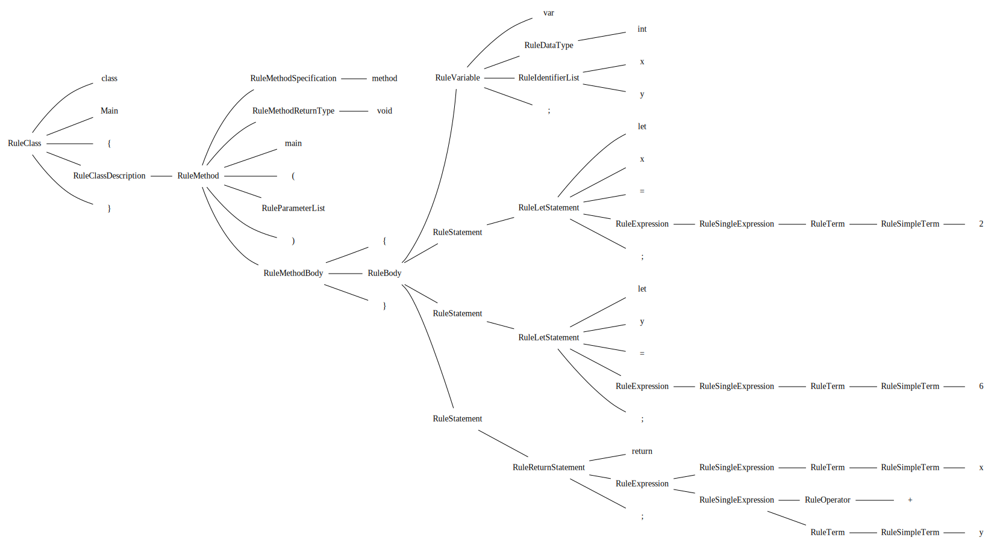

<h1>Extra Tools</h1>

<a href="https://github.com/CharlesCarley/HackComputer#~">~</a>
<a href="index.md#index">HackComputer</a>
/
<b>Hc08</b>
 
 
Extra optional tools that are not part of the source.

<h2>Parse Tree Visual</h2>
The syntax analyzer has the extra option to output the parse tree in 
<code class="typewriter">.dot</code>
 format. The dot program is part of the graphviz tool-set.
<ul>
<li><a href="https://graphviz.org/#graphviz">GraphViz</a>
</li>
</ul>

<h2>GRM files</h2>
The grammar files are for the most part reference only. They do not use any of the code generation features of the Gold Parsing Engine, but they were initially written and tested with the tool-set.
I believe it is a dead project, which is a shame because it is an awesome tool-set to 
<code class="typewriter">quickly</code>
 throw together and test grammars.
<ul>
<li><a href="http://www.goldparser.org/#goldparser">GoldParser</a>
</li>
</ul>

</body>
</html>
