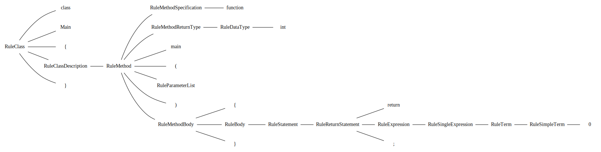

<a id="compiler"></a>
<h1>Compiler</h1>
<a id="a01581"></a>
<a href="https://github.com/CharlesCarley/HackComputer#~">~</a>
<a href="index.md#index">HackComputer</a>
<span class="inline-text">/</span>
<span class="bold-text"><b>Hc05</b></span>
<br/>
<br/>
<span class="inline-text">Implements the compiler for the .jack source file.</span>
<br/>
<br/>
<span class="inline-text">
The primary job of the compiler is to take the high-level jack language and translate it from, </span>
<code class="typewriter">.jack,</code>
<span class="inline-text"> to </span>
<code class="typewriter">.vm,</code>
<span class="inline-text"> then </span>
<code class="typewriter">.asm,</code>
<span class="inline-text"> and finally to machine code.</span>
<a id="a01581_1hc05syntaxanalyzer"></a>
<a id="syntaxanalyzer"></a>
<h2>SyntaxAnalyzer</h2>
<span class="inline-text">The SyntaxAnalyzer project provides a static library that compiles the jack code into an intermediate parse tree. </span>
<br/>
<br/>
<span class="inline-text">
The definition for the jack grammar can be found </span>
<a href="../../Source/Compiler/Analyzer/Jack.grm#here.">here.</a>
<span class="inline-text"> Where the primary difference in syntax between this implementation and the course is that the not operator </span>
<code class="typewriter">!</code>
<span class="inline-text"> is implemented both as &apos;~&apos; and &apos;!&apos;.</span>
<a id="a01581_1hc05compileutils"></a>
<a id="compileutils"></a>
<h2>CompileUtils</h2>
<span class="inline-text">Provides an intermediate static library that implements the parse tree structure. The parse tree structure is meant to be shared between multiple projects.</span>
<span class="inline-text">It also contains extra general classes that provide output formats for the parse tree.</span>
<a id="a01581_1hc05jack2xml"></a>
<a id="jack2xml"></a>
<h2>Jack2XML</h2>
<span class="inline-text">Is an executable project that provides the means to output inspection files.</span>
<br/>
<br/>

```txt
Usage: Jack2xml <options> <arg[0] .. arg[n]>

    -h, --help       Display this help message
    -f, --format     Specify an output file format
                      - xml, format as XML (default)
                      - dot, format as DOT
    -d, --directory  Converts all .jack files in the current directory to .xml
    -o, --output     Specify an output file
                       - the directory option takes precedence
```
<a id="a01581_1hc05jack2xml_0"></a>
<a id="example"></a>
<h3>Example</h3>
<br/>
<span class="italic-text"><i>Input:</i></span>
<span class="inline-text"> The following shows the output of Jack2XML using the supplied </span>
<code class="typewriter">.jack</code>
<span class="inline-text"> source file.</span>
<br/>
<br/>

```txt
class Main
{
    function int main()
    {
        return 0;
    }
}
```
<br/>
<span class="italic-text"><i>Xml:</i></span>
<span class="inline-text"> Shows the output using </span>
<a href="a01182.md#xmlwriterimpl">Hack::Compiler::XmlWriterImpl</a>
<br/>
<br/>

```xml
<?xml version='1.0'?>
<ClassList Filename="example.jack">
 <RuleClass>
   <Keyword>class</Keyword>
   <Identifier>Main</Identifier>
   <Symbol>{</Symbol>
   <RuleClassDescription>
     <RuleMethod>
       <RuleMethodSpecification>
         <Keyword>function</Keyword>
       </RuleMethodSpecification>
       <RuleMethodReturnType>
         <RuleDataType>
           <Keyword>int</Keyword>
         </RuleDataType>
       </RuleMethodReturnType>
       <Identifier>main</Identifier>
       <Symbol>(</Symbol>
       <RuleParameterList>
       </RuleParameterList>
       <Symbol>)</Symbol>
       <RuleMethodBody>
         <Symbol>{</Symbol>
         <RuleBody>
           <RuleStatement>
             <RuleReturnStatement>
               <Keyword>return</Keyword>
               <RuleExpression>
                 <RuleSingleExpression Subtype="SubtypeTerm">
                   <RuleTerm>
                     <RuleSimpleTerm>
                       <Identifier>0</Identifier>
                     </RuleSimpleTerm>
                   </RuleTerm>
                 </RuleSingleExpression>
               </RuleExpression>
               <Symbol>;</Symbol>
             </RuleReturnStatement>
           </RuleStatement>
         </RuleBody>
         <Symbol>}</Symbol>
       </RuleMethodBody>
     </RuleMethod>
   </RuleClassDescription>
   <Symbol>}</Symbol>
 </RuleClass>
</ClassList>
```
<br/>
<span class="italic-text"><i>dot:</i></span>
<span class="inline-text"> Shows the output using </span>
<a href="a01162.md#dotwriterimpl">Hack::Compiler::DotWriterImpl</a>
<span class="inline-text"> after it has be converted to SVG with dot.</span>
<br/>
<br/>
<a id="a01581_1hc05codegenerator"></a>
<a id="codegenerator"></a>
<h2>CodeGenerator</h2>
<span class="inline-text">Is a static library which implements the conversion from parse tree to </span>
<code class="typewriter">.vm</code>
<span class="inline-text">.</span>
<a id="a01581_1hc05compiler"></a>
<a id="compiler"></a>
<h2>Compiler</h2>
<span class="inline-text">The current state of this project does not implement a standalone compiler. Instead, compilation happens in the </span>
<a href="a01583.md#hc07">Computer</a>
<span class="inline-text"> executable.</span>
<a id="a01581_1hc05defined"></a>
<a id="defined-in"></a>
<h2>Defined in</h2>
<span class="inline-text">The source is defined in </span>
<a href="../../Source/Compiler#source-compiler">Source/Compiler</a>
<br/>
</div>
</div>
</body>
</html>
