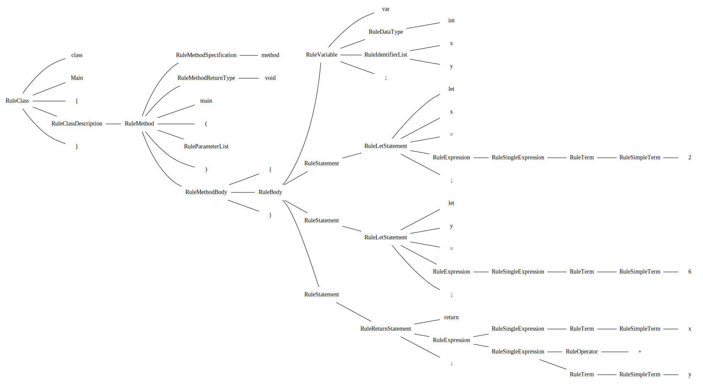

<h1>Extra Tools</h1>

<a href="https://github.com/CharlesCarley/HackComputer#~">~</a>
<a href="index.md#index">HackComputer</a>
/
<b>Hc08</b>
 
 
Describes extra tools that were used that are not part of the source.

<h2>Parse Tree Visual</h2>
The 
<a href="a01581.md#hc05">Jack2XML</a>
 executable has an extra option that allows the parse tree to be output in 
<code class="typewriter">.dot</code>
<a href="https://graphviz.org/#format.">format.</a>

<h2>GRM files</h2>
The grammar files are for the most part reference only. They do not use any of the code generation features of the 
<a href="http://www.goldparser.org/#gold-parsing-engine.">Gold Parsing Engine.</a>
 But they were initially written and tested with it 

</body>
</html>
