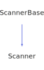

<h1>Scanner</h1>

<a href="https://github.com/CharlesCarley/HackComputer.md">~</a>
<a href="indexpage.md#hack">Hack</a>
/
<a href="index.md#index">Index</a>
/
<a href="namespaceHack.md#hack">Hack</a>
::
<a href="namespaceHack_1_1Compiler.md#compiler">Compiler</a>
::
<a href="namespaceHack_1_1Compiler_1_1Analyzer.md#analyzer">Analyzer</a>
::
<b>Scanner</b>
 
 

<h4>Derived From</h4>

<a href="classHack_1_1ScannerBase.md#hackscannerbase">Hack::ScannerBase</a>

 

<h2>Private Members</h2>
<a href="#_code" class="icon-list-item">_code
</a>

 

<h2>Private Methods</h2>
<a href="#scancode" class="icon-list-item">scanCode
</a>

 
<a href="#scandigit" class="icon-list-item">scanDigit
</a>

 
<a href="#scanstring" class="icon-list-item">scanString
</a>

 
<a href="#scansymbol" class="icon-list-item">scanSymbol
</a>

 

<h2>Public Methods</h2>
<a href="#scanner" class="icon-list-item">Scanner
</a>

 
<a href="#getcode" class="icon-list-item">getCode
</a>

 
<a href="#scan" class="icon-list-item">scan
</a>

 

<h4>Defined in</h4>
<a href="https://github.com/CharlesCarley/HackComputer/blob/master//Source/Compiler/Analyzer/Scanner.h#L32" class="icon-list-item">Scanner.h
</a>

 

<h2>_code</h2>
<a href="namespaceHack_1_1Compiler_1_1Analyzer.md#codecache">CodeCache</a>
<b>_code</b>
 

<h4>Defined in</h4>
<a href="https://github.com/CharlesCarley/HackComputer/blob/master//Source/Compiler/Analyzer/Scanner.h#L35" class="icon-list-item">Scanner.h
</a>

 
 

<h2>scanCode</h2>
void
<b>scanCode</b>
<i>(</i>

<a href="namespaceHack_1_1Compiler_1_1Analyzer.md#token">Token</a>
 &amp;
tok

<i>)</i>

<h4>Defined in</h4>
<a href="https://github.com/CharlesCarley/HackComputer/blob/master//Source/Compiler/Analyzer/Scanner.h#L37" class="icon-list-item">Scanner.h
</a>

 
<a href="https://github.com/CharlesCarley/HackComputer/blob/master//Source/Compiler/Analyzer/Scanner.cpp#L71" class="icon-list-item">Scanner.cpp
</a>

 
 

<h2>scanDigit</h2>
void
<b>scanDigit</b>
<i>(</i>

<a href="namespaceHack_1_1Compiler_1_1Analyzer.md#token">Token</a>
 &amp;
tok

<i>)</i>

<h4>Defined in</h4>
<a href="https://github.com/CharlesCarley/HackComputer/blob/master//Source/Compiler/Analyzer/Scanner.h#L41" class="icon-list-item">Scanner.h
</a>

 
<a href="https://github.com/CharlesCarley/HackComputer/blob/master//Source/Compiler/Analyzer/Scanner.cpp#L115" class="icon-list-item">Scanner.cpp
</a>

 
 

<h2>scanString</h2>
void
<b>scanString</b>
<i>(</i>

<a href="namespaceHack_1_1Compiler_1_1Analyzer.md#token">Token</a>
 &amp;
tok

<i>)</i>

<h4>Defined in</h4>
<a href="https://github.com/CharlesCarley/HackComputer/blob/master//Source/Compiler/Analyzer/Scanner.h#L43" class="icon-list-item">Scanner.h
</a>

 
<a href="https://github.com/CharlesCarley/HackComputer/blob/master//Source/Compiler/Analyzer/Scanner.cpp#L133" class="icon-list-item">Scanner.cpp
</a>

 
 

<h2>scanSymbol</h2>
void
<b>scanSymbol</b>
<i>(</i>

<a href="namespaceHack_1_1Compiler_1_1Analyzer.md#token">Token</a>
 &amp;
tok

<i>)</i>

<h4>Defined in</h4>
<a href="https://github.com/CharlesCarley/HackComputer/blob/master//Source/Compiler/Analyzer/Scanner.h#L39" class="icon-list-item">Scanner.h
</a>

 
<a href="https://github.com/CharlesCarley/HackComputer/blob/master//Source/Compiler/Analyzer/Scanner.cpp#L81" class="icon-list-item">Scanner.cpp
</a>

 
 

<h2>Scanner</h2>
<b>Scanner</b>
<i>(</i>
<i>)</i>

<h4>Defined in</h4>
<a href="https://github.com/CharlesCarley/HackComputer/blob/master//Source/Compiler/Analyzer/Scanner.h#L47" class="icon-list-item">Scanner.h
</a>

 
 

<h2>getCode</h2>
void
<b>getCode</b>
<i>(</i>

<a href="namespaceHack.md#string">String</a>
 &amp;
dest

const size_t &amp;
idx

<i>)</i>

<h4>References</h4>
<a href="classHack_1_1ScannerBase.md#syntaxerror" class="icon-list-item">syntaxError
</a>

 

<h4>Defined in</h4>
<a href="https://github.com/CharlesCarley/HackComputer/blob/master//Source/Compiler/Analyzer/Scanner.h#L51" class="icon-list-item">Scanner.h
</a>

 
<a href="https://github.com/CharlesCarley/HackComputer/blob/master//Source/Compiler/Analyzer/Scanner.cpp#L189" class="icon-list-item">Scanner.cpp
</a>

 
 

<h2>scan</h2>
void
<b>scan</b>
<i>(</i>

<a href="namespaceHack_1_1Compiler_1_1Analyzer.md#token">Token</a>
 &amp;
tok

<i>)</i>

<h4>References</h4>
<a href="classHack_1_1ScannerBase.md#_stream" class="icon-list-item">_stream
</a>

 
<a href="classHack_1_1ScannerBase.md#syntaxerror" class="icon-list-item">syntaxError
</a>

 
<a href="classHack_1_1TokenBase.md#clear" class="icon-list-item">clear
</a>

 
<a href="classHack_1_1TokenBase.md#setline" class="icon-list-item">setLine
</a>

 
<a href="classHack_1_1ScannerBase.md#_line" class="icon-list-item">_line
</a>

 
<a href="classHack_1_1ScannerBase.md#scanlinecomment" class="icon-list-item">scanLineComment
</a>

 
<a href="classHack_1_1ScannerBase.md#scanmultilinecomment" class="icon-list-item">scanMultiLineComment
</a>

 
<a href="classHack_1_1TokenBase.md#settype" class="icon-list-item">setType
</a>

 
<a href="namespaceHack_1_1Compiler_1_1Analyzer.md#tokopdivide" class="icon-list-item">TokOpDivide
</a>

 
<a href="classHack_1_1ScannerBase.md#scanwhitespace" class="icon-list-item">scanWhiteSpace
</a>

 
<a href="namespaceHack_1_1Compiler_1_1Analyzer.md#tokopplus" class="icon-list-item">TokOpPlus
</a>

 
<a href="namespaceHack_1_1Compiler_1_1Analyzer.md#tokopminus" class="icon-list-item">TokOpMinus
</a>

 
<a href="namespaceHack_1_1Compiler_1_1Analyzer.md#tokopmultiply" class="icon-list-item">TokOpMultiply
</a>

 
<a href="namespaceHack_1_1Compiler_1_1Analyzer.md#tokopand" class="icon-list-item">TokOpAnd
</a>

 
<a href="namespaceHack_1_1Compiler_1_1Analyzer.md#tokopor" class="icon-list-item">TokOpOr
</a>

 
<a href="namespaceHack_1_1Compiler_1_1Analyzer.md#tokopnot" class="icon-list-item">TokOpNot
</a>

 
<a href="namespaceHack_1_1Compiler_1_1Analyzer.md#tokopeq" class="icon-list-item">TokOpEq
</a>

 
<a href="namespaceHack_1_1Compiler_1_1Analyzer.md#tokoplt" class="icon-list-item">TokOpLt
</a>

 
<a href="namespaceHack_1_1Compiler_1_1Analyzer.md#tokopgt" class="icon-list-item">TokOpGt
</a>

 
<a href="namespaceHack_1_1Compiler_1_1Analyzer.md#toksymperiod" class="icon-list-item">TokSymPeriod
</a>

 
<a href="namespaceHack_1_1Compiler_1_1Analyzer.md#toksymlbrace" class="icon-list-item">TokSymLBrace
</a>

 
<a href="namespaceHack_1_1Compiler_1_1Analyzer.md#toksymrbrace" class="icon-list-item">TokSymRBrace
</a>

 
<a href="namespaceHack_1_1Compiler_1_1Analyzer.md#toksymlbracket" class="icon-list-item">TokSymLBracket
</a>

 
<a href="namespaceHack_1_1Compiler_1_1Analyzer.md#toksymrbracket" class="icon-list-item">TokSymRBracket
</a>

 
<a href="namespaceHack_1_1Compiler_1_1Analyzer.md#toksymlpar" class="icon-list-item">TokSymLPar
</a>

 
<a href="namespaceHack_1_1Compiler_1_1Analyzer.md#toksymrpar" class="icon-list-item">TokSymRPar
</a>

 
<a href="namespaceHack_1_1Compiler_1_1Analyzer.md#toksymcomma" class="icon-list-item">TokSymComma
</a>

 
<a href="namespaceHack_1_1Compiler_1_1Analyzer.md#toksymsemicolon" class="icon-list-item">TokSymSemicolon
</a>

 
<a href="namespaceHack_1_1Compiler_1_1Analyzer.md#tokeof" class="icon-list-item">TokEof
</a>

 

<h4>Defined in</h4>
<a href="https://github.com/CharlesCarley/HackComputer/blob/master//Source/Compiler/Analyzer/Scanner.h#L49" class="icon-list-item">Scanner.h
</a>

 
<a href="https://github.com/CharlesCarley/HackComputer/blob/master//Source/Compiler/Analyzer/Scanner.cpp#L197" class="icon-list-item">Scanner.cpp
</a>

 
 

</body>
</html>
