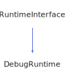

<h1>DebugRuntime</h1>

<a href="https://github.com/CharlesCarley/HackComputer.md">~</a>
<a href="indexpage.md#hack">Hack</a>
/
<a href="index.md#index">Index</a>
/
<a href="namespaceHack.md#hack">Hack</a>
::
<a href="namespaceHack_1_1Computer.md#computer">Computer</a>
::
<b>DebugRuntime</b>
 
 

<h4>Derived From</h4>

<a href="classHack_1_1Computer_1_1RuntimeInterface.md#hackcomputerruntimeinterface">Hack::Computer::RuntimeInterface</a>

 

<h2>Private Members</h2>
<a href="#_private" class="icon-list-item">_private
</a>

 

<h2>Private Methods</h2>
<a href="#getrate" class="icon-list-item">getRate
</a>

 

<h2>Public Methods</h2>
<a href="#debugruntime" class="icon-list-item">DebugRuntime
</a>

 
<a href="#~debugruntime" class="icon-list-item">~DebugRuntime
</a>

 
<a href="#exitrequest" class="icon-list-item">exitRequest
</a>

 
<a href="#flushmemory" class="icon-list-item">flushMemory
</a>

 
<a href="#initialize" class="icon-list-item">initialize
</a>

 
<a href="#processevents" class="icon-list-item">processEvents
</a>

 
<a href="#shouldupdate" class="icon-list-item">shouldUpdate
</a>

 
<a href="#update" class="icon-list-item">update
</a>

 

<h4>Defined in</h4>
<a href="https://github.com/CharlesCarley/HackComputer/blob/master//Source/Computer/DebugRuntime.h#L31" class="icon-list-item">DebugRuntime.h
</a>

 

<h2>_private</h2>
<a href="classHack_1_1Computer_1_1DebugRuntimePrivate.md#debugruntimeprivate">DebugRuntimePrivate</a>
 *
<b>_private</b>
 

<h4>Defined in</h4>
<a href="https://github.com/CharlesCarley/HackComputer/blob/master//Source/Computer/DebugRuntime.h#L33" class="icon-list-item">DebugRuntime.h
</a>

 
 

<h2>getRate</h2>
int16_t
<b>getRate</b>
<i>(</i>
<i>)</i>

<h4>Defined in</h4>
<a href="https://github.com/CharlesCarley/HackComputer/blob/master//Source/Computer/DebugRuntime.h#L35" class="icon-list-item">DebugRuntime.h
</a>

 
 

<h2>DebugRuntime</h2>
<b>DebugRuntime</b>
<i>(</i>
<i>)</i>

<h4>Defined in</h4>
<a href="https://github.com/CharlesCarley/HackComputer/blob/master//Source/Computer/DebugRuntime.h#L41" class="icon-list-item">DebugRuntime.h
</a>

 
<a href="https://github.com/CharlesCarley/HackComputer/blob/master//Source/Computer/DebugRuntime.cpp#L535" class="icon-list-item">DebugRuntime.cpp
</a>

 
 

<h2>~DebugRuntime</h2>
<b>~DebugRuntime</b>
<i>(</i>
<i>)</i>

<h4>Defined in</h4>
<a href="https://github.com/CharlesCarley/HackComputer/blob/master//Source/Computer/DebugRuntime.h#L43" class="icon-list-item">DebugRuntime.h
</a>

 
<a href="https://github.com/CharlesCarley/HackComputer/blob/master//Source/Computer/DebugRuntime.cpp#L540" class="icon-list-item">DebugRuntime.cpp
</a>

 
 

<h2>exitRequest</h2>
bool
<b>exitRequest</b>
<i>(</i>
<i>)</i>

<h4>References</h4>
<a href="classHack_1_1Computer_1_1DebugRuntimePrivate.md#input" class="icon-list-item">input
</a>

 
<a href="namespaceHack_1_1Ui.md#pr_exit" class="icon-list-item">PR_EXIT
</a>

 

<h4>Defined in</h4>
<a href="https://github.com/CharlesCarley/HackComputer/blob/master//Source/Computer/DebugRuntime.h#L49" class="icon-list-item">DebugRuntime.h
</a>

 
<a href="https://github.com/CharlesCarley/HackComputer/blob/master//Source/Computer/DebugRuntime.cpp#L558" class="icon-list-item">DebugRuntime.cpp
</a>

 
 

<h2>flushMemory</h2>
void
<b>flushMemory</b>
<i>(</i>

<a href="classHack_1_1Chips_1_1Computer.md#chipscomputer">Chips::Computer</a>
 *
computer

<i>)</i>

<h4>References</h4>
<a href="classHack_1_1Computer_1_1DebugRuntimePrivate.md#flushmemory" class="icon-list-item">flushMemory
</a>

 

<h4>Defined in</h4>
<a href="https://github.com/CharlesCarley/HackComputer/blob/master//Source/Computer/DebugRuntime.h#L53" class="icon-list-item">DebugRuntime.h
</a>

 
<a href="https://github.com/CharlesCarley/HackComputer/blob/master//Source/Computer/DebugRuntime.cpp#L568" class="icon-list-item">DebugRuntime.cpp
</a>

 
 

<h2>initialize</h2>
void
<b>initialize</b>
<i>(</i>

<a href="classHack_1_1Chips_1_1Computer.md#chipscomputer">Chips::Computer</a>
 *
computer

<a href="namespaceHack_1_1Chips.md#chipsscreen">Chips::Screen</a>
 *

<i>)</i>

<h4>References</h4>
<a href="classHack_1_1Computer_1_1DebugRuntimePrivate.md#initialize" class="icon-list-item">initialize
</a>

 
<a href="classHack_1_1Computer_1_1DebugRuntimePrivate.md#flushmemory" class="icon-list-item">flushMemory
</a>

 

<h4>Defined in</h4>
<a href="https://github.com/CharlesCarley/HackComputer/blob/master//Source/Computer/DebugRuntime.h#L47" class="icon-list-item">DebugRuntime.h
</a>

 
<a href="https://github.com/CharlesCarley/HackComputer/blob/master//Source/Computer/DebugRuntime.cpp#L552" class="icon-list-item">DebugRuntime.cpp
</a>

 
 

<h2>processEvents</h2>
void
<b>processEvents</b>
<i>(</i>

<a href="classHack_1_1Chips_1_1Computer.md#chipscomputer">Chips::Computer</a>
 *
computer

<i>)</i>

<h4>References</h4>
<a href="classHack_1_1Computer_1_1DebugRuntimePrivate.md#processevents" class="icon-list-item">processEvents
</a>

 

<h4>Defined in</h4>
<a href="https://github.com/CharlesCarley/HackComputer/blob/master//Source/Computer/DebugRuntime.h#L51" class="icon-list-item">DebugRuntime.h
</a>

 
<a href="https://github.com/CharlesCarley/HackComputer/blob/master//Source/Computer/DebugRuntime.cpp#L563" class="icon-list-item">DebugRuntime.cpp
</a>

 
 

<h2>shouldUpdate</h2>
bool
<b>shouldUpdate</b>
<i>(</i>
<i>)</i>

<h4>References</h4>
<a href="classHack_1_1Computer_1_1DebugRuntimePrivate.md#input" class="icon-list-item">input
</a>

 
<a href="namespaceHack_1_1Ui.md#pr_up_arrow" class="icon-list-item">PR_UP_ARROW
</a>

 
<a href="namespaceHack_1_1Ui.md#pr_r" class="icon-list-item">PR_R
</a>

 
<a href="classHack_1_1Computer_1_1DebugRuntimePrivate.md#block" class="icon-list-item">block
</a>

 

<h4>Defined in</h4>
<a href="https://github.com/CharlesCarley/HackComputer/blob/master//Source/Computer/DebugRuntime.h#L45" class="icon-list-item">DebugRuntime.h
</a>

 
<a href="https://github.com/CharlesCarley/HackComputer/blob/master//Source/Computer/DebugRuntime.cpp#L546" class="icon-list-item">DebugRuntime.cpp
</a>

 
 

<h2>update</h2>
void
<b>update</b>
<i>(</i>

<a href="classHack_1_1Chips_1_1Computer.md#chipscomputer">Chips::Computer</a>
 *
computer

<i>)</i>

<h4>References</h4>
<a href="classHack_1_1Chips_1_1Computer.md#update" class="icon-list-item">update
</a>

 
<a href="classHack_1_1Chips_1_1Computer.md#capturestate" class="icon-list-item">captureState
</a>

 

<h4>Defined in</h4>
<a href="https://github.com/CharlesCarley/HackComputer/blob/master//Source/Computer/DebugRuntime.h#L55" class="icon-list-item">DebugRuntime.h
</a>

 
<a href="https://github.com/CharlesCarley/HackComputer/blob/master//Source/Computer/DebugRuntime.cpp#L573" class="icon-list-item">DebugRuntime.cpp
</a>

 
 

</body>
</html>
