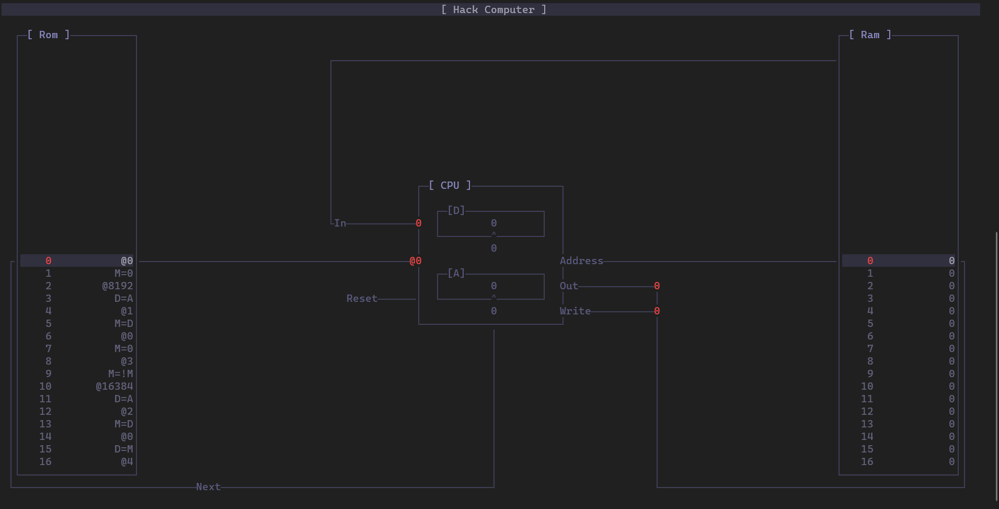

# Hack Computer

This repository is my implementation of the Hack computer in C++/Dart from the nand2Tetris [course #1](https://www.coursera.org/learn/build-a-computer).

## Utils

The [utils](Source/Utils/) library implements basic utilities that are used project wide.

- [Source/Utils](Source/Utils/) provides STL string conversion utilities, and console output utilities
- [Source/Utils/CommandLine](Source/Utils/CommandLine/) implements a STL version of the [Utils](https://github.com/CharlesCarley/Utils) command line library (Non STL)  
- [Source/Utils/UserInterface](Source/Utils/UserInterface/) provides a cross platform console drawing context

## Chips

The [chip library](Source/Chips/) implements the .hdl circuits in C++.

The bulk of this library is split into two forms. The first form is with the black box implemented.
I wanted to keep the chip functionality present rather than abstract it away for testing purposes. It links the circuits together in code but it is a lot slower. The second form is with the circuit behavior abstracted away and replaced C++.

The build option `Hack_IMPLEMENT_BLACK_BOX` will toggle it on or off.

## Assembler

The [assembler](Source/Assembler/) implements the machine code compiler.
It outputs two targets:

- A static library so that the parser can be used in other areas of code
- A program that takes an assembly file as input and outputs the binary instructions

## Computer

The [computer](Source/Computer/) ties together the ROM, RAM and CPU chips and implements multiple runtime targets.


If SDL is enabled, the default runtime will open a window and map the screen region of memory to the SDL window. Otherwise if SDL is disabled, the default and only runtime is the command line debugger. 

## Flutter

The [web library](Web/) Is a flutter version of the command line debugger. It binds the computer library to dart with `dart:ffi` and [`web_ffi`](https://pub.dev/packages/web_ffi).

It targets the desktop and web flutter platforms, and is still a _work in progress_.

It allows directly editing and recompiling the source as well as mapping the screen to a flutter widget.


## Building

It uses CMake to generate its make files.

The [Build](Build) directory contains a utility python script that ties together different build types

- cpp - Standard CMake/C++
- em - Command line EMSDK tools
- fl - flutter build

for more info run the help command in the build directory:

```sh
build help
```

### Defines

Optional CMake definitions used in this project.

| Option                   | Description                                                               | Default |
|:-------------------------|:--------------------------------------------------------------------------|:-------:|
| Hack_BUILD_TEST          | Build the unit test program.                                              |   OFF   |
| Hack_AUTO_RUN_TEST       | Automatically run the test program.                                       |   OFF   |
| Hack_CHECK_INT_BOUNDS    | Throw an overflow exception when testing individual bits.                 |   ON    |
| Hack_IMPLEMENT_BLACK_BOX | If this is true most chips will be implemented with logic gates (Slower). |   OFF   |
| Hack_PRINT_CHIP_STATE    | Enables the print method defined in the Chip base class.                  |   OFF   |
| Hack_USE_SDL             | Enables or disables SDL                                                   |   OFF   |

## Testing

The testing directory is setup to work with [googletest](https://github.com/google/googletest).

It also contains the initial setup for testing the standalone module using GitHub actions.
