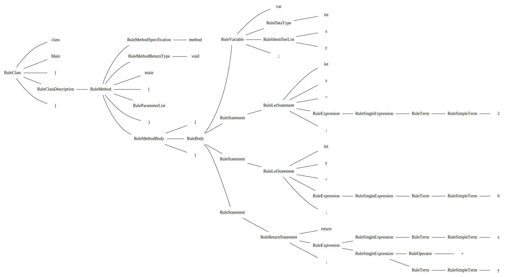

# Hack Computer

This repository is my implementation of the Hack computer in C++ from the [NAnd2Tetris course](https://www.coursera.org/learn/build-a-computer).
It is a bit over the top and does not strictly adhere to the course. I chose to opt out of the certificate of completion instead chose to support the authors by buying the e-book. I wanted something self-contained at the end. In order to do that, the supplied tools in the course material had to be written from scratch (to some extent; hence being over the top).

## Project Structure

The following outline details the overall structure.

It is split into multiple namespace projects under the primary Hack namespace.

- [Hack Computer](#hack-computer)
  - [Project Structure](#project-structure)
    - [Utils](#utils)
    - [Chips](#chips)
    - [Assembler](#assembler)
      - [ASM Grammar](#asm-grammar)
      - [Asm2Mc](#asm2mc)
    - [Virtual Machine](#virtual-machine)
      - [VM Grammar](#vm-grammar)
      - [Vm2Asm](#vm2asm)
    - [Compiler Tools](#compiler-tools)
      - [SyntaxAnalyzer](#syntaxanalyzer)
        - [Jack Grammar](#jack-grammar)
      - [Jack2XML](#jack2xml)
      - [CompileUtils](#compileutils)
      - [CodeGenerator](#codegenerator)
      - [Compiler](#compiler)
    - [Bindings](#bindings)
    - [Computer](#computer)
  - [Building](#building)
    - [Defines](#defines)
  - [Testing](#testing)
  - [Extra Tools](#extra-tools)
    - [Parse Tree Visual](#parse-tree-visual)
    - [GRM files](#grm-files)

### Utils

The [utils](Source/Utils/) library implements basic utilities that are used project wide.

- [Source/Utils](Source/Utils/) provides STL string conversion utilities, and console output utilities
- [Source/Utils/CommandLine](Source/Utils/CommandLine/) implements a STL version of the [Utils](https://github.com/CharlesCarley/Utils) command line library
- [Source/Utils/UserInterface](Source/Utils/UserInterface/) provides a cross platform console drawing context

### Chips

The [chip library](Source/Chips/) implements the .hdl circuits in C++.

The bulk of this library is split into two forms. The first form is with the black box implemented.
I wanted to keep the chip functionality present rather than abstract it away for testing purposes. It links the circuits together in code but it is a lot slower. The second form is with the circuit behavior abstracted away and replaced with C++.

The build option `Hack_IMPLEMENT_BLACK_BOX` will toggle it on or off.

### Assembler

The [assembler](Source/Assembler/) implements the machine code compiler.

The primary target is a static library so that the parser can be used in other areas of code.

#### ASM Grammar

See the [ASM.grm](Source/Assembler/ASM.grm) for the implemented grammar.

#### Asm2Mc

Is a program that takes an assembly file as input and outputs the binary instructions.

```txt
Usage: asm2mc <options> <arg[0] .. arg[n]>

    -h, --help    Display this help message
    -o, --output  Specify an output file
```

### Virtual Machine

The [VM](Source/VirtualMachine/) implements the vm code compiler.

The primary target is a static library so that it can be used in other areas of code.

#### VM Grammar

See the [VM.grm](Source/VirtualMachine/VM.grm) for the implemented grammar.

Extra options not in the main specification.

- __set__ `set <int> <int>`
  - Allows directly setting RAM values
- __reset__ `reset`
  - Forces a CPU reset by jumping to the end of ROM
    - `@32766 D=A;JMP`
- __halt__ `halt`
  - Will emit code that enters into an infinite loop

#### Vm2Asm

Is a program that takes a '.vm' file as input and emits assembly code.

```txt
Usage: vm2mc <options> <arg[0] .. arg[n]>

    -h, --help    Display this help message
    -o, --output  Specify an output file
```

### Compiler Tools

This project is a collection of tools that implements the recommended compiler structure.


#### SyntaxAnalyzer

The [syntax analyzer](Source/Compiler/Analyzer) takes an input `.jack` file and builds the parse tree which can be either, saved to `.xml` or used directly to emit `.vm` code.

##### Jack Grammar

See the [Jack.grm](Source/Compiler/Analyzer/Jack.grm) for the implemented grammar.

Extra options not in the main specification per personal preference.

- __NOT__ `!`
  - The not unary operator is implemented as '~' and '!', both have the same meaning.

#### Jack2XML

```txt
Usage: Jack2xml <options> <arg[0] .. arg[n]>

    -h, --help       Display this help message
    -f, --format     Specify an output file format
                      - xml, format as XML (default)
                      - dot, format as DOT
    -d, --directory  Converts all .jack files in the current directory to .xml
    -o, --output     Specify an output file
                       - the directory option takes precedence
```

#### CompileUtils

Houses the parse tree and other utilities that tie together the syntax analyzer and the code generator.

#### CodeGenerator

#### Compiler

Is the compiler that ties together the whole system into a single executable file that can be executed with the computer executable.

### Bindings

Provides a binding interface to use in other languages.

### Computer

The [computer](Source/Computer/) ties together the ROM, RAM and CPU chips and implements multiple runtime targets.

If SDL is enabled, the default runtime will open a window and map the screen region of memory to the SDL window. Otherwise if SDL is disabled, the default and only runtime is the [command line debugger](Content/Debugger.png).

```txt
Usage: computer <options> <arg[0] .. arg[n]>

    -h, --help      Display this help message
    -c              Use the command line runtime
    -d              Debug the supplied file
    -r, --run-end   Run the supplied file until it exits
    -t, --trace     Output a dump of the non-zero portions of ram
        --show-vm   Output the emitted VM code from the supplied file
        --show-asm  Output the emitted assembly code from the supplied file
        --show-mc   Output the emitted machine code from the supplied file

```

## Building

It uses CMake to generate its make files.

### Defines

Optional CMake definitions used in this project.

| Option                   | Description                                                                                                              | Default |
|:-------------------------|:-------------------------------------------------------------------------------------------------------------------------|:-------:|
| Hack_BUILD_TEST          | Build the unit test program.                                                                                             |   OFF   |
| Hack_AUTO_RUN_TEST       | Automatically run the test program.                                                                                      |   OFF   |
| Hack_CHECK_INT_BOUNDS    | Throw an overflow exception when testing individual bits.                                                                |   ON    |
| Hack_IMPLEMENT_BLACK_BOX | If this is true most chips will be implemented with logic gates (Slower).                                                |   OFF   |
| Hack_PRINT_CHIP_STATE    | Enables the print method defined in the Chip base class.                                                                 |   OFF   |
| Hack_VM_ZERO_RAM         | Emits extra instructions to zero RAM values that are no longer in use. Useful when debugging with the Computer option -t |   OFF   |
| Hack_BLOCK_PUSH          | Emits conditional instructions to prevent pushing to segments when its out of context.                                   |   OFF   |
| Hack_USE_SDL             | Enables or disables SDL                                                                                                  |   OFF   |

## Testing

The [testing directory](Test/) is setup to work with [google test](https://github.com/google/googletest).

It also contains the initial setup for testing the standalone module using GitHub actions.

## Extra Tools

### Parse Tree Visual

The syntax analyzer has the extra option to output the parse tree in `.dot` format. The dot program is part of the graphviz tool-set.

- [GraphViz](https://graphviz.org/)



### GRM files

The grammar files are for the most part reference only. They do not use any of the code generation features of the Gold Parsing Engine, but they were initially written and tested with the tool-set.

I believe it is a dead project, which is a shame because it is an awesome tool-set to `quickly` throw together and test grammars.

- [GoldParser](http://www.goldparser.org/)